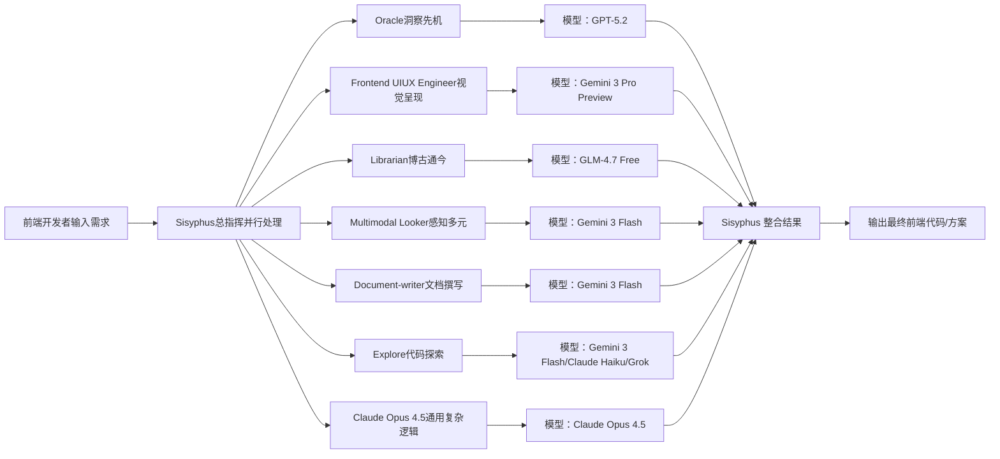
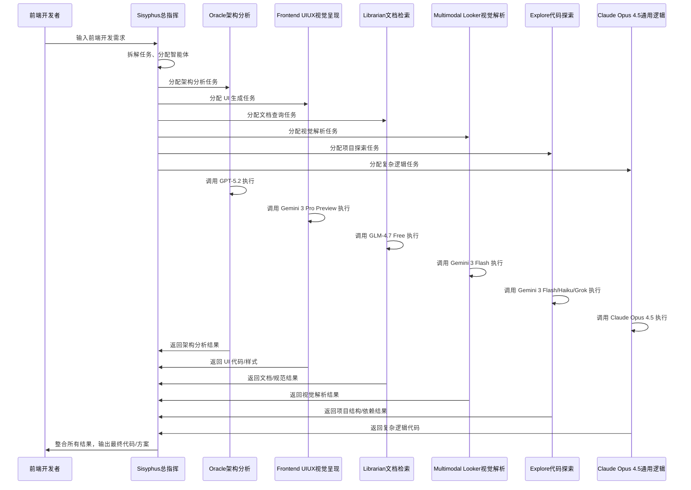

# Oh My OpenCode (OMO) 多智能体并行处理架构（含时序图与指令模板）

下载说明（极简版）：全选本文档所有内容 → 复制 → 打开电脑记事本（或任意文本编辑器）→ 粘贴 → 保存（文件名填：OMO多智能体架构.md，保存类型选“所有文件”，编码UTF-8），保存后即为可直接使用的纯MD文件。

## 一、架构核心总览

这是 OMO 插件的多智能体并行处理核心架构图，核心是由总指挥 `Sisyphus` 统一调度，将前端开发任务拆解给多个专业智能体，各智能体绑定专属 AI 模型并行执行，最终整合结果。

### 架构总览图（Mermaid，可直接渲染）



## 二、智能体与模型对应表

|智能体名称|核心职能|绑定 AI 模型|前端场景适配|
|---|---|---|---|
|Sisyphus|总指挥、并行处理、任务调度、结果整合|-|全局任务统筹，分配子任务给各智能体|
|Oracle|架构分析、性能优化、Bug 定位、方案洞察|GPT-5.2|前端架构选型、性能瓶颈分析、线上 Bug 排查|
|Frontend UI/UX Engineer|UI 生成、视觉呈现、响应式布局、样式实现|Gemini 3 Pro Preview|组件 UI 设计、多端视觉适配、交互样式开发|
|Librarian|文档检索、框架/库用法查询、知识调用|GLM-4.7 Free|查找 Ant Design/VueUse 等库的用法、查询前端规范|
|Multimodal Looker|视觉信息解析、感知多元、设计稿转代码|Gemini 3 Flash|Figma/PS 设计稿转前端代码、提取视觉元素|
|Document-writer|技术文档、代码注释、使用说明生成|Gemini 3 Flash|组件文档、API 注释、开发手册编写|
|Explore|项目结构分析、代码检索、依赖解析|Gemini 3 Flash/Claude Haiku/Grok|解析前端项目目录、查找指定组件/函数、提取依赖|
|Claude Opus 4.5|通用复杂逻辑处理、深度编码、复杂任务执行|Claude Opus 4.5|复杂业务逻辑开发、状态管理、跨组件协作|
## 三、工作时序图（核心流程）

清晰展示从需求输入到结果输出的全流程时序逻辑，突出并行处理特性，可直接在支持Mermaid的MD编辑器中渲染。

### 时序图（Mermaid）



## 四、智能体调用指令模板

支持直接@智能体名称调用专属能力，跳过通用调度流程，提升响应速度与执行精度，以下是前端开发高频场景模板，可直接复制使用。

### 4.1 通用调用语法

```Plain Text
@智能体名称 具体指令内容
```

### 4.2 各智能体高频指令模板

#### 1. @Oracle（架构分析/性能优化）

- 模板1：架构选型与方案设计
        `@Oracle 为我设计一个基于 Next.js + Tailwind CSS 的电商首页架构，包含路由规划、状态管理方案和性能优化点`

- 模板2：Bug 定位与修复建议
`@Oracle 分析我这段 React 组件的性能瓶颈，给出具体优化代码和修复方案`

- 模板3：代码重构建议
        `@Oracle 对我这段 Vue 组件代码进行重构，提升可读性与可维护性，符合 Vue 3 最佳实践`

#### 2. @Frontend UI/UX Engineer（UI 生成/视觉实现）

- 模板1：响应式组件开发
        `@Frontend UI/UX Engineer 用 React + Ant Design 5.x 开发一个响应式商品卡片组件，适配移动端和桌面端，支持 hover 效果和快速查看按钮`

- 模板2：多端视觉适配
`@Frontend UI/UX Engineer 将 Figma 设计稿中的登录页面转换为完整的 Vue 3 + Element Plus 代码，确保像素级还原且适配不同屏幕`

- 模板3：交互样式优化
        `@Frontend UI/UX Engineer 优化这个按钮组件的样式，添加渐变背景、圆角过渡和点击动效，符合现代 UI 设计规范`

#### 3. @Librarian（文档检索/用法查询）

- 模板1：框架/库用法查询
        `@Librarian 查找 Ant Design 5.x 中 Modal 组件的自定义样式用法，给出可直接复制的代码示例`

- 模板2：最佳实践整理
        `@Librarian 整理 React 函数组件中使用 useEffect 的最佳实践，包含常见陷阱和避坑指南`

- 模板3：规范查询
       `@Librarian 查询 TypeScript 在前端项目中的类型定义规范，给出基础类型声明和接口编写示例`

#### 4. @Multimodal Looker（视觉解析/设计稿转代码）

- 模板1：设计稿元素提取
        `@Multimodal Looker 提取这张设计稿中的颜色值、字体规范和间距参数，整理成可直接使用的 CSS 变量`

- 模板2：设计稿转代码
        `@Multimodal Looker 将这张移动端首页设计稿转换为 React + Tailwind CSS 代码，实现完整页面结构和样式`

#### 5. @Document-writer（文档生成/注释编写）

- 模板1：组件文档生成
        `@Document-writer 为我这个 React 商品卡片组件生成详细的技术文档，包含组件属性、使用示例和注意事项`

- 模板2：代码注释补充
`@Document-writer 为这段复杂的 Vue 业务逻辑代码补充详细的注释，说明每个函数的作用和参数含义`

#### 6. @Explore（项目分析/代码检索）

- 模板1：项目结构分析`@Explore 分析当前前端项目的目录结构，列出核心组件、工具函数和依赖模块`

- 模板2：指定代码查找
        `@Explore 在项目中查找所有使用 Axios 封装的请求函数，列出文件路径和核心代码`

#### 7. @Claude Opus 4.5（复杂逻辑开发）

- 模板1：复杂业务逻辑实现
        `@Claude Opus 4.5 开发一个基于 Redux Toolkit 的购物车逻辑，包含添加商品、删除商品、数量修改和价格计算功能`

- 模板2：跨组件状态管理
        `@Claude Opus 4.5 编写一个全局主题切换的状态管理逻辑，支持多组件同步更新主题色`

## 五、核心工作逻辑

1. 需求接收：前端开发者输入开发需求（如“开发登录组件”），由 `Sisyphus` 接收并拆解任务。

2. 智能体分配：`Sisyphus` 根据任务类型，将子任务分配给对应专业智能体（如 UI 任务给 `Frontend UI/UX Engineer`，架构分析给 `Oracle`）。

3. 模型并行执行：各智能体调用绑定的专属 AI 模型并行处理，互不等待，提升效率。

4. 结果整合：`Sisyphus` 收集所有智能体的执行结果，统一整合优化。

5. 最终输出：向开发者交付可直接使用的前端代码、方案或文档。

## 六、核心优势

- 并行处理：多任务同时执行，大幅缩短开发周期。

- 专业适配：每个智能体绑定最优模型，保证对应职能的输出精度。

- 全流程覆盖：多个智能体覆盖前端开发全流程，模拟专业开发团队协作。

- 指令精准：直接@智能体调用，跳过通用调度，提升开发效率与结果精度。

补充：文档支持用 Typora、VS Code（安装Markdown插件）、WPS 等打开，流程图自动渲染，可直接编辑使用。
> （注：文档部分内容可能由 AI 生成）