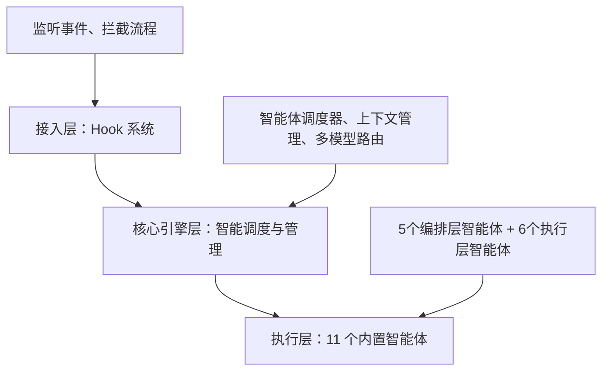
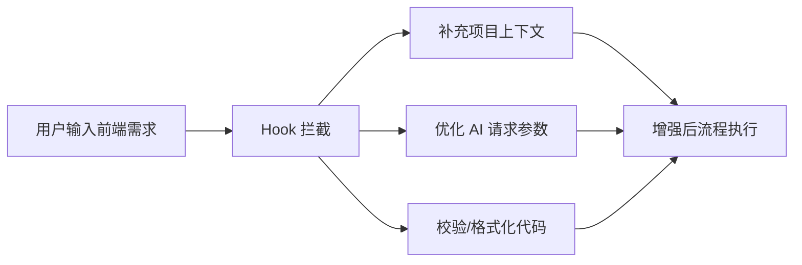
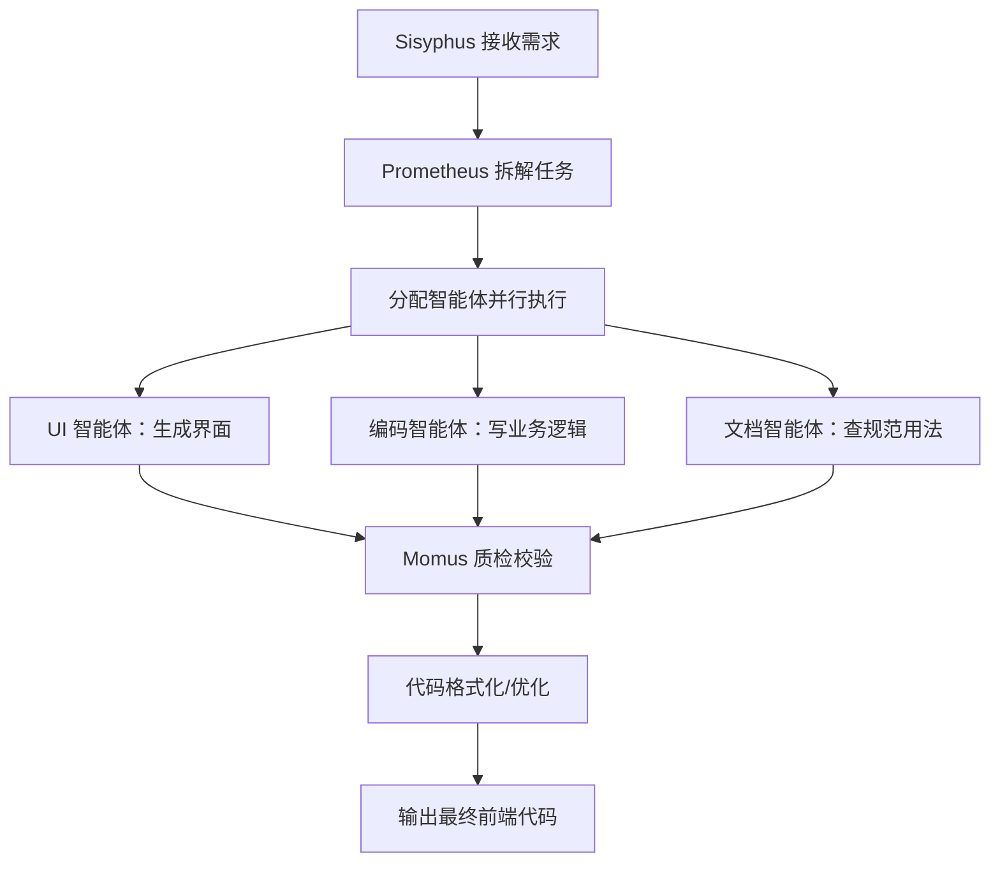

# Oh My OpenCode (OMO) 插件原理（图表化优化版・前端工程师专用）

文档说明：本文档为标准 Markdown 格式，可直接复制至 MD 编辑器（Typora、VS Code 等）使用，所有图表逻辑清晰，重点突出前端工程师关注的核心原理、流程与细节，排版简洁易读，兼顾专业性与实用性。

## 一、OMO 核心定位（一句话速览）

|核心定位|具体说明|
|---|---|
|插件属性|OpenCode IDE 无侵入式智能体增强框架插件|
|核心价值|将单一 AI 助手升级为「多智能体协同前端开发团队」|
|技术本质|钩子拦截系统 + 智能体编排引擎 + 上下文管理器 + 多模型路由|
|核心目标|实现前端开发全流程自动化，提升开发效率与代码质量|
## 二、OMO 整体架构（三层架构图）

各层核心内容：

- 接入层（Hook 系统）：监听事件、拦截流程，实现无侵入增强

- 核心引擎层：包含智能体调度器、上下文管理、多模型路由，是插件核心大脑

- 执行层：包含 5 个编排层智能体 + 6 个执行层智能体，负责具体任务落地

### 2.1 接入层：Hook 系统（核心无侵入能力）

|钩子名称|触发时机|核心功能（前端场景）|
|---|---|---|
|chat.message|用户输入消息后|拦截指令，自动补充项目依赖、组件规范、上下文历史|
|chat.params|发送 LLM 请求前|动态调整模型参数（温度、token 数等），适配前端开发场景|
|tool.execute.before|工具执行前|校验命令合法性、依赖完整性、路径正确性|
|tool.execute.after|工具执行后|代码格式化（Prettier）、语法修复（ESLint）、错误提示|
|event|全局事件触发时|监听文件创建/保存/编译，触发自定义操作（如自动安装依赖）|
## 三、OMO 11 个内置智能体（分类清晰版）

### 3.1 智能体分层与数量分布

|智能体层级|数量|核心职责|
|---|---|---|
|核心编排层|5 个|任务统筹、规划、监控、质检、执行推进|
|专业执行层|6 个|编码、UI/UX、调试、文档、代码检索、多模态解析|
### 3.2 智能体详细清单

#### 核心编排层（5 个，前端开发统筹角色）

|智能体名称|核心定位|前端场景核心职责|
|---|---|---|
|Sisyphus|总指挥|全局任务拆解、智能体调度、结果整合、流程闭环|
|Prometheus|需求规划师|前端需求解析、任务拆分、开发计划生成、需求澄清|
|Metis|监控官|监控 token 消耗、上下文完整性、开发进度、异常预警|
|Momus|质检员|前端代码审查、规范校验、BUG 识别、优化建议|
|Atlas|推进官|按计划执行任务、衔接智能体工作、保障流程顺畅|
#### 专业执行层（6 个，前端开发执行角色）

|智能体名称|核心定位|前端场景核心职责|
|---|---|---|
|Hephaestus|编码工程师|编写 React/Vue 组件、实现业务逻辑、对接 API、状态管理|
|Frontend UI/UX Engineer|前端 UI/UX 专家|UI 生成、响应式布局、样式实现、交互优化、多端适配|
|Oracle|架构与调试专家|前端架构选型、性能优化、BUG 定位、代码重构建议|
|Librarian|文档专家|检索框架/组件库文档、查询 API 用法、整理开发最佳实践|
|Explore|代码检索专家|分析前端项目结构、查找指定文件/组件、提取依赖信息|
|Multimodal Looker|多模态解析专家|设计稿转代码、提取视觉元素、解析截图中的布局与样式|
## 四、OMO 四大核心原理（流程化+规则化）

### 4.1 核心原理 1：钩子拦截机制（无侵入增强）

### 4.2 核心原理 2：多智能体协同（工作流程）

### 4.3 核心原理 3：智能上下文管理（核心能力）

|能力类型|具体功能（前端场景）|
|---|---|
|上下文自动压缩|删除重复对话，提炼技术栈、组件、需求等关键信息|
|项目知识图谱|自动记录项目结构、依赖、样式方案、组件库信息|
|断点自动恢复|会话超时/中断后自动恢复，保留开发进度|
|分块加载机制|大文件/长代码分块传输，避免 token 超限|
### 4.4 核心原理 4：多模型智能路由与降级

|任务类型|适配模型|路由规则|
|---|---|---|
|简单查询（如语法提问）|轻量大模型|快速响应、降低成本|
|代码生成（组件/逻辑）|代码专用模型|保障代码生成精度|
|UI/设计稿转代码|多模态模型|支持视觉信息解析|
|架构/性能优化|高精度大模型|深度分析、精准优化|
|异常场景兜底|本地轻量模型|主模型不可用时自动切换|
## 五、前端开发完整执行流程（极简步骤图）

## 六、OMO 与原生 OpenCode 核心对比（一目了然）

|对比维度|原生 OpenCode|OMO 增强版|
|---|---|---|
|AI 角色|单一 AI 助手|11 个专业智能体协同团队|
|任务能力|简单指令响应|前端全流程自动化开发|
|上下文管理|易丢失、无压缩|智能压缩+永久记忆+断点恢复|
|代码质量|基础生成无校验|自动格式化+ESLint 校验+优化|
|模型支持|单模型固定|多模型路由+自动降级容错|
|开发流程|手动分步触发|全流程自动闭环|
## 七、终极总结（一句话+核心关键词）

|总结类型|内容|
|---|---|
|一句话终极总结|OMO 通过钩子无侵入接管 OpenCode 流程，用 11 个智能体模拟完整前端开发团队，结合智能上下文与多模型路由，实现从需求到代码的全自动生成与优化|
|核心关键词|无侵入钩子、多智能体协同、智能上下文、多模型路由、前端全流程自动化|
补充说明：本文档所有流程图可直接在支持 Mermaid 的 MD 编辑器中渲染，表格、标题排版均符合标准 Markdown 规范，可直接复制使用，无需额外调整。
> （注：文档部分内容可能由 AI 生成）