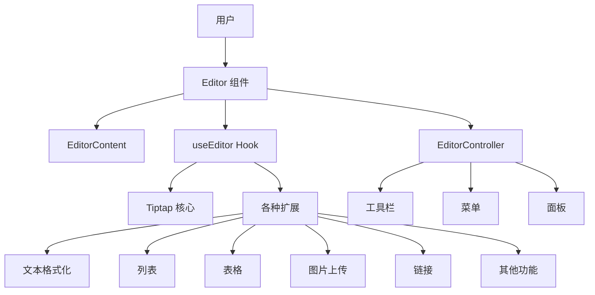

# 富文本编辑器组件分析报告

## 1. 项目概览

**富文本编辑器**是一个基于 Tiptap 构建的现代化 React 富文本编辑器组件，提供了丰富的编辑功能和友好的用户界面。

- **基于 Tiptap 2.9.1** 构建，充分利用其扩展性和灵活性
- **集成 Sass 和 Ant Design**，实现现代化的 UI 设计
- **支持丰富的富文本功能**，包括文本格式化、列表、表格、图片上传等
- **提供国际化支持**，包含中英文语言包
- **模块化设计**，易于扩展和定制

## 2. 目录结构

项目采用清晰的模块化结构，将核心编辑器、扩展、UI 组件等分离，便于维护和扩展。所有编辑器相关的文件都集中在 `src/components/` 目录下，实现了高度的模块化和内聚性。

```text
src/
├── components/           # 核心编辑器组件
│   ├── control/         # 编辑器控制组件
│   ├── extension/       # 功能扩展
│   ├── menus/           # 编辑器菜单
│   ├── panels/          # 编辑器面板
│   ├── ui/              # 通用 UI 组件
│   ├── utils/           # 工具函数
│   ├── viewer/          # 内容查看器
│   ├── locales/         # 国际化文件
│   │   ├── en-us.ts     # 英文语言包
│   │   ├── zh-cn.ts     # 中文语言包
│   │   └── zh-tw.ts     # 繁体中文语言包
│   ├── constants.tsx    # 常量定义
│   ├── hooks.ts         # 核心 hooks
│   ├── index.tsx        # 编辑器主组件
│   └── types.tsx        # 类型定义
│   ├── globals.modules.scss          # 全局样式
│   └── index.ts             # 项目入口

```

**核心模块职责表**：

| 模块       | 主要职责               | 文件位置                  | 说明                             |
| ---------- | ---------------------- | ------------------------- | -------------------------------- |
| 核心编辑器 | 提供编辑功能和状态管理 | src/components/index.tsx  | 基于 Tiptap 构建的主编辑器组件   |
| 扩展系统   | 提供各种编辑功能扩展   | src/components/extension/ | 包含文本格式化、列表、表格等扩展 |
| 控制组件   | 管理编辑器工具栏和交互 | src/components/control/   | 包含字符计数、拖拽处理等         |
| 菜单系统   | 提供编辑操作菜单       | src/components/menus/     | 包含文本菜单、链接菜单等         |
| 面板系统   | 提供高级编辑功能面板   | src/components/panels/    | 包含颜色选择器、链接编辑器等     |
| 内容查看器 | 只读模式下的内容展示   | src/components/viewer/    | 用于展示编辑结果                 |
| 国际化     | 提供多语言支持         | src/components/locales/   | 支持中英文切换                   |

## 3. 系统架构与主流程

编辑器采用了基于 Tiptap 的扩展架构，通过组合多个功能扩展来构建完整的编辑能力。这种架构设计使得编辑器具有高度的可扩展性和灵活性。

### 系统架构



### 主要流程

1. **初始化流程**：
   - 用户创建 Editor 组件并传入配置
   - useEditor Hook 初始化 Tiptap 编辑器实例
   - 加载并配置各种扩展
   - 渲染 EditorContent 和 EditorController

2. **编辑流程**：
   - 用户在 EditorContent 中输入内容
   - Tiptap 处理编辑操作并更新内部状态
   - 通过 onChange 回调将内容变化通知给父组件
   - EditorController 根据当前选择状态更新工具栏和菜单

3. **扩展管理**：
   - 核心扩展由 useEditor 自动加载
   - 支持通过 extensions 属性添加自定义扩展
   - 每个扩展独立实现特定功能，如文本格式化、图片上传等

## 4. 核心功能模块

### 4.1 文本编辑与格式化

提供丰富的文本格式化功能，包括字体大小、字体家族、颜色、高亮、下划线、上标、下标等。

- **实现方式**：基于 Tiptap 的 TextStyle、FontSize、FontFamily、Color、Highlight、Underline、Subscript、Superscript 扩展
- **使用场景**：富文本编辑中对文本样式的精细控制
- **关键文件**：
  - src/components/extension/font-size/FontSize.ts
  - src/components/menus/TextMenu/components/FontSizePicker.tsx
  - src/components/menus/TextMenu/components/FontFamilyPicker.tsx

### 4.2 结构化内容

支持多种结构化内容，如标题、列表、表格、引用等。

- **实现方式**：基于 Tiptap 的 Heading、BulletList、OrderedList、TaskList、TaskItem、Table 等扩展
- **使用场景**：创建具有层次结构的文档
- **关键文件**：
  - src/components/extension/heading/index.ts
  - src/components/extension/task-item/task-item.ts
  - src/components/extension/table/Table.ts
  - src/components/extension/block-quote-figure/BlockquoteFigure.ts

### 4.3 媒体处理

支持图片上传和管理，包括图片块的创建和编辑。

- **实现方式**：自定义 ImageUpload 和 ImageBlock 扩展
- **使用场景**：在文档中插入和管理图片
- **关键文件**：
  - src/components/extension/image-upload/ImageUpload.ts
  - src/components/extension/image-block/ImageBlock.ts
  - src/components/extension/image-block/components/ImageBlockView.tsx

### 4.4 高级交互

提供拖拽、斜杠命令等高级交互功能，提升编辑体验。

- **实现方式**：自定义 GlobalDragHandle 和 SlashCommand 扩展
- **使用场景**：通过拖拽调整内容顺序，通过斜杠命令快速插入内容
- **关键文件**：
  - src/components/extension/global-drag-handle/index.ts
  - src/components/extension/slash-command/index.ts
  - src/components/extension/slash-command/MenuList.tsx

### 4.5 国际化支持

提供多语言支持，包括中文、英文和繁体中文。

- **实现方式**：通过 locales 目录下的语言包文件
- **使用场景**：在不同语言环境下使用编辑器
- **关键文件**：
  - src/components/locales/en-us.ts
  - src/components/locales/zh-cn.ts
  - src/components/locales/zh-tw.ts
  - src/components/utils/locale.ts

## 5. 核心 API/类/函数

### 5.1 Editor 组件

**功能**：编辑器的主组件，提供完整的编辑功能
**参数**：

- `limit`：字符数限制
- `value`：初始内容（JSON 字符串）
- `onChange`：内容变化回调
- `onCreate`：编辑器创建回调
- `extensions`：自定义扩展
- `slashCommandProps`：斜杠命令配置
- `uploadImage`：图片上传函数

**返回值**：React 组件，包含编辑器界面

**使用场景**：在应用中嵌入富文本编辑器

### 5.2 useEditor Hook

**功能**：初始化和管理 Tiptap 编辑器实例
**参数**：

- `limit`：字符数限制
- `value`：初始内容
- `onChange`：内容变化回调
- `onCreate`：编辑器创建回调
- `extensions`：自定义扩展
- `slashCommandProps`：斜杠命令配置
- `uploadImage`：图片上传函数

**返回值**：`[editor, data, handleId]`，分别是编辑器实例、节点数据和拖拽句柄 ID

**使用场景**：在自定义组件中使用编辑器功能

### 5.3 ContentViewer 组件

**功能**：以只读模式展示编辑器内容
**参数**：

- `value`：要展示的内容（JSON 字符串）
- `className`：自定义类名

**返回值**：React 组件，展示内容

**使用场景**：在不需要编辑的场景下展示富文本内容

### 5.4 getJSONString 函数

**功能**：将编辑器内容转换为 JSON 字符串
**参数**：`editor`：Tiptap 编辑器实例
**返回值**：JSON 字符串表示的编辑器内容
**使用场景**：获取编辑器内容用于保存或传输

### 5.5 updateAttrById 函数

**功能**：更新指定 ID 节点的属性
**参数**：

- `json`：编辑器内容的 JSON 表示
- `id`：节点 ID
- `attr`：要更新的属性名
- `value`：新的属性值

**返回值**：无，直接修改传入的 JSON 对象
**使用场景**：更新特定节点的属性，如任务项的完成状态

## 6. 技术栈与依赖

| 技术/依赖      | 版本    | 用途             | 来源                    |
| -------------- | ------- | ---------------- | ----------------------- |
| React          | -       | 前端框架         | package.json            |
| Tiptap         | 2.9.1   | 富文本编辑器核心 | package.json            |
| scss           | -       | 样式框架         | package.json (keywords) |
| antd           | 2.x     | UI 组件库        | package.json            |
| UUID           | 10.0.0  | 生成唯一 ID      | package.json            |
| Lowlight       | 3.1.0   | 代码语法高亮     | package.json            |
| Nanoid         | 5.0.9   | 生成短 ID        | package.json            |
| React Colorful | 5.6.1   | 颜色选择器       | package.json            |
| Interact.js    | 1.10.27 | 拖拽交互         | package.json            |
| Sass           | -       | CSS 预处理器     | 项目依赖                |
| Ant Design     | -       | UI 组件库        | 项目依赖                |

## 7. 关键模块与典型用例

### 7.1 基本编辑器使用

**功能说明**：创建一个基本的富文本编辑器
**配置与依赖**：

- 导入 Editor 组件
- 可选：配置上传图片函数

**使用示例**：

```jsx
import { Editor } from "./components";

function MyEditor() {
	const [content, setContent] = useState("");

	const handleUploadImage = async (file) => {
		// 实现图片上传逻辑
		return {
			url: "https://example.com/image.jpg",
			alt: file.name,
		};
	};

	return (
		<Editor
			value={content}
			onChange={setContent}
			uploadImage={handleUploadImage}
		/>
	);
}
```

### 7.2 内容查看器使用

**功能说明**：以只读模式展示富文本内容
**配置与依赖**：

- 导入 ContentViewer 组件

**使用示例**：

```jsx
import { ContentViewer } from "./components";

function MyContentViewer() {
	const content =
		'{"type":"doc","content":[{"type":"paragraph","content":[{"type":"text","text":"Hello World"}]}]}';

	return <ContentViewer value={content} />;
}
```

### 7.3 自定义扩展

**功能说明**：向编辑器添加自定义功能扩展
**配置与依赖**：

- 创建自定义 Tiptap 扩展
- 在 Editor 组件中传入 extensions 属性

**使用示例**：

```jsx
import { Editor } from "./components";
import { Extension } from "@tiptap/core";

// 创建自定义扩展
const MyCustomExtension = Extension.create({
	name: "myCustomExtension",
	// 扩展实现...
});

function MyEditorWithCustomExtension() {
	return (
		<Editor
			extensions={[MyCustomExtension]}
			// 其他属性...
		/>
	);
}
```

## 8. 监控与维护

### 8.1 常见问题与解决方案

1. **图片上传失败**
   - 检查 `uploadImage` 函数是否正确实现
   - 确保服务器端支持文件上传

2. **编辑器内容不更新**
   - 检查 `onChange` 回调是否正确处理
   - 确保 `value` 属性正确传递

3. **扩展不生效**
   - 检查扩展是否正确导入
   - 确保扩展与 Tiptap 版本兼容

### 8.2 性能优化

- **延迟加载**：对于大型扩展，考虑使用动态导入
- **内容限制**：使用 `limit` 属性限制编辑器内容大小
- **防抖处理**：对 `onChange` 回调进行防抖，减少频繁更新

## 9. 总结与亮点回顾

**富文本编辑器**是一个功能丰富、易于使用的富文本编辑器组件，基于 Tiptap 构建，提供了现代化的编辑体验。

### 主要亮点：

1. **模块化设计**：清晰的目录结构和模块化架构，便于维护和扩展
2. **丰富的功能**：支持文本格式化、列表、表格、图片上传等多种编辑功能
3. **现代化 UI**：集成 TailwindCSS、Sass 和 Ant Design，提供美观的用户界面
4. **灵活的扩展系统**：基于 Tiptap 的扩展机制，支持自定义功能
5. **国际化支持**：内置多语言支持，适应不同地区用户
6. **良好的类型定义**：使用 TypeScript，提供完整的类型支持
7. **拖拽功能**：实现了全局拖拽功能，提升用户体验
8. **斜杠命令**：支持通过斜杠命令快速插入内容，提高编辑效率

### 应用场景：

- **内容管理系统**：用于编辑文章、页面内容
- **富文本编辑器**：集成到各种需要文本编辑功能的应用中
- **协作工具**：支持多人协作编辑
- **CMS 系统**：作为内容创建和编辑的核心组件

富文本编辑器是一个设计精良、功能全面的富文本编辑解决方案，适合各种需要富文本编辑功能的应用场景。其模块化设计和扩展机制使得它具有很强的适应性和可定制性，可以根据具体需求进行调整和扩展。
